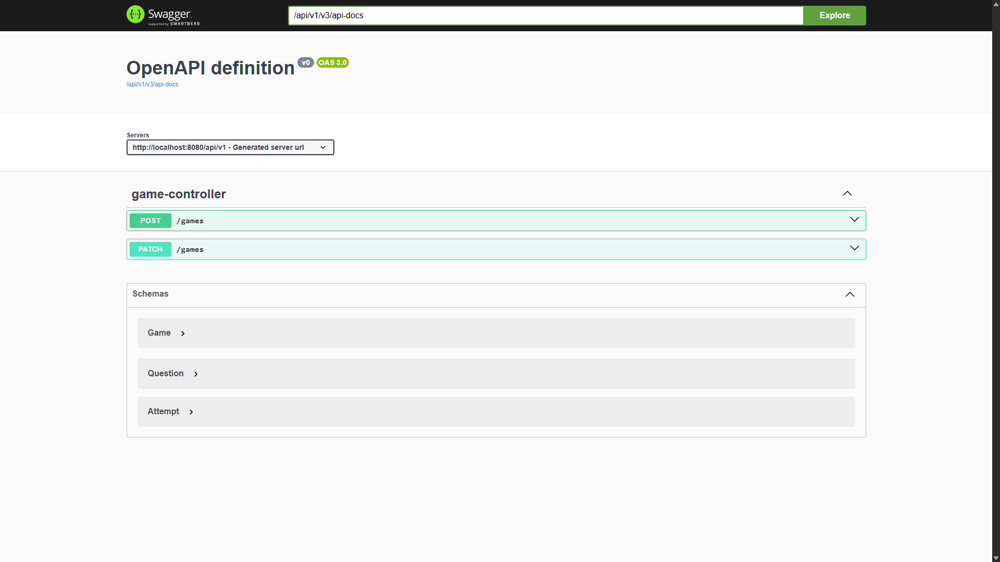

## Quiz API

I created this simple Quiz API just to build a simple FullStack Quiz Game to put into my portifolio.

## Used Technologies

- Spring Boot 3.3.0
- JUnit 5
- Java 21
- Docker
- GitHub Actions
- Swagger

## How does it work?

It simply reads a CSV file to create the questions and uses a HashMap to handle the "session" game.

## How to run?

You will only need Docker to run it.

- ``docker run -d -p 8080:8080 diielsilva/quiz-api:latest``

## Endpoints

You can see all endpoints by accessing http://localhost:8080/api/v1/swagger-ui.html

